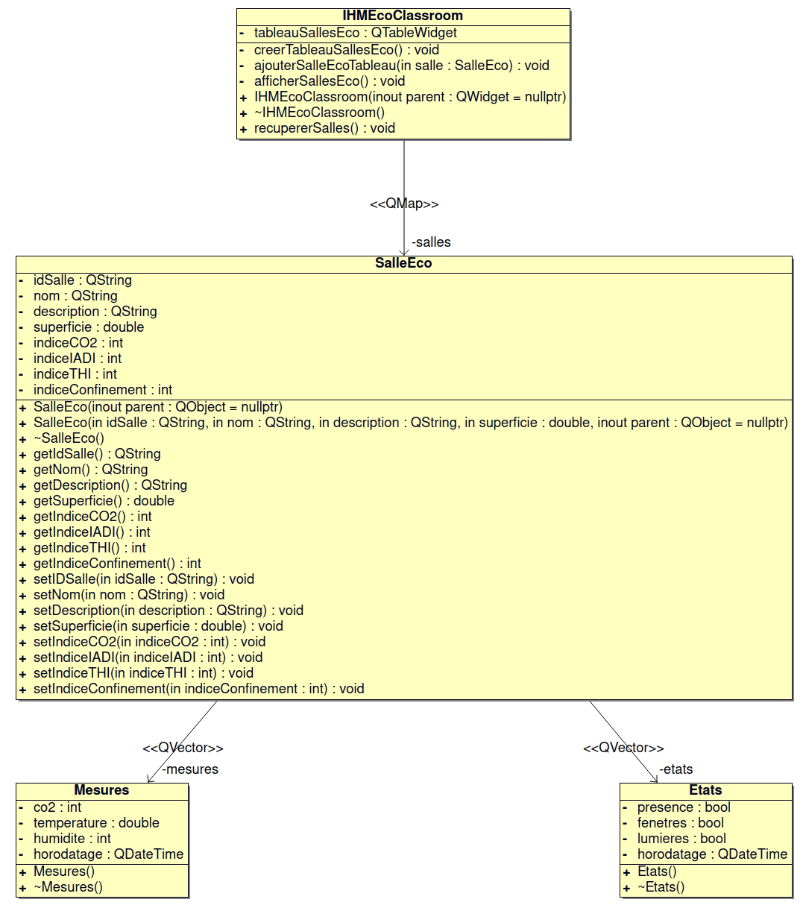
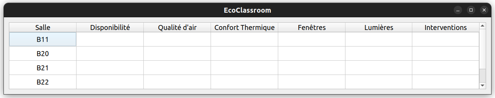

 

  

# Le projet eco-classroom 2024

- [Le projet eco-classroom 2024](#le-projet-eco-classroom-2024)
  - [Présentation](#présentation)
  - [Fonctionnalités](#fonctionnalités)
    - [Desktop (C++/Qt)](#desktopcqt)
  - [Documentation du code](#documentation-du-code)
  - [Diagramme de classes](#diagramme-de-classes)
    - [EcoClassroom-desktop (C++/Qt)](#ecoclassroom-desktopcqt)
  - [Protocole](#protocole)
  - [Itérations](#itérations)
    - [Itération 1](#itération-1)
    - [Itération 2](#itération-2)
    - [Itération 3](#itération-3)
  - [Screenshots](#screenshots)
  - [Historique des versions](#historique-des-versions)
    - [Version 0.1](#version-01)
      - [Desktop](#desktop)
  - [Recette](#recette)
  - [Auteurs](#auteurs)

---

## Présentation

Le système assure une supervision de salles dans un établissement scolaire. Chaque salle sera équipée de deux modules connectés afin de détecter et mesurer l’état de celle-ci.

Les informations seront accessibles à partir d’une tablette ou d’une application PC permettant aux personnels d’assurer un suivi et d’intervenir en conséquence.

## Fonctionnalités

### Desktop (C++/Qt)

## Documentation du code

https://btssn-lasalle-84.github.io/eco-classroom-2024/

## Diagramme de classes

### EcoClassroom-desktop (C++/Qt)

## Protocole

## Itérations

### Itération 1

- **Visualiser l'ensemble des salles** : L'utilisateur peut avoir un aperçu des salles dans un tableau
- **Connecter la base de données** : L'application est associée à la base de données

### Itération 2

- **Filtrer les salles** : L'utilisateur peut effectuer une recherche avec des critères précis
- **Affichage d'une salle spécifique** : L'utilisateur peut visualiser une salle spécifique
- **Calculer les indices** : Les indices sont calculés et affichés dans l'IHM
- **Communiquer avec les modules** : L'application communique avec les différents modules

### Itération 3

- **Editer une salle** : L'utilisateur peut éditer des informations sur une salle spécifique
- **Signalement dépassement de seuils** : L'application affiche les dépassements de seuils des salles

## Screenshots

## Historique des versions

### Version 0.1

#### Desktop

- Afficher un tableau de l'ensemble des salles
- Relié à la base de données

## Recette

| Fonctionnalités                 | Oui | Non |
|---------------------------------|:---:|:---:|
| Affichage IHM principale        |  X  |     |
| Récuperer l'ensemble des salles |  X  |     |
| Calcul des indices              |     |  X  |

## Auteurs

- Étudiant IR (Desktop) : VIGNAL Thomas <<thomasvignal.btssn@gmail.com>>
- Étudiant IR (Mobile) : VALOBRA Enzo <<valobra.enzo@gmail.com>>

---
©️ LaSalle Avignon 2024
