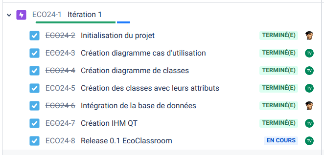

 

# Le projet eco-classroom 2024

- [Le projet eco-classroom 2024](#le-projet-eco-classroom-2024)
  - [Présentation](#présentation)
  - [Fonctionnalités](#fonctionnalités)
  - [Recette](#recette)
  - [Screenshots](#screenshots)
  - [Diaporama de présentation](#diaporama-de-présentation)
  - [Diagramme de classes](#diagramme-de-classes)
  - [Protocole](#protocole)
  - [Itérations](#itérations)
    - [Itération 1](#itération-1)
    - [Itération 2](#itération-2)
    - [Itération 3](#itération-3)
  - [Historique des versions](#historique-des-versions)
    - [Version 1.0](#version-10)
    - [Version 0.2](#version-02)
    - [Version 0.1](#version-01)
  - [Documentation du code](#documentation-du-code)
  - [Auteurs](#auteurs)

---

## Présentation

Le système assure une supervision de salles dans un établissement scolaire. Chaque salle sera équipée de deux modules connectés afin de détecter et mesurer l’état de celle-ci.

Les informations seront accessibles à partir d’une tablette ou d’une application PC permettant aux personnels d’assurer un suivi et d’intervenir en conséquence.

## Fonctionnalités

## Recette

| Fonctionnalités                 | Oui | Non |
|---------------------------------|:---:|:---:|
| Affichage IHM principale        |  X  |     |
| Récuperer l'ensemble des salles |  X  |     |
| Calcul des indices              |  X  |     |
| Afficher les indices            |  X  |     |
| Dialoguer avec les modules      |  X  |     |
| Afficher une salle              |     |  X  |
| Filtrer les salles              |     |  X  |
| Editer une salle                |     |  X  |

## Screenshots

## Diaporama de présentation

- [Oral projet - VIGNAL.pptx](diaporamas/Oral%20projet%20-%20VIGNAL.pptx)

## Diagramme de classes

## Protocole

Le protocole MQTT fonctionne sous forme d’abonnement (_suscribe_) à un topic entre un client et un serveur.

Ici, le client MQTT est l’application Qt.

Le serveur MQTT est le broker MQTT de la passerelle qui reçoit les publications (_publish_) des publieurs (_publishers_).

Les publieurs (_publishers_) sont les modules sonde et détection.

L'application EcoClassroom-desktop (C++/Qt), donc le client MQTT, est abonné à un topic qui est le suivant : `salles/#`

Le `#` signifie un abonnement au topic en multi-sujet. C'est-à-dire que tous les _publish_ transmis par les _publishers_ comportant une racine `/salles` seront envoyés à leurs abonnés.

Les données des modules sonde et détection sont publiées sur un topic qui a la structure suivante : `salles/nom/module/type`

- Le champ `nom` indique le nom de la salle, par exemple : B20, B11, …
- Le champ `module` peut prendre les valeurs suivantes : sonde|detection
- Le champ `type` peut prendre les valeurs suivantes : 
temperature|humidite|co2|fenetres|lumieres|disponibilite

Exemple : La donnée `20.5` associée au topic `salles/B20/sonde/temperature` sera une température en Celsius publiée par le module sonde de la salle B20.

## Itérations

### Itération 1

- **Visualiser l'ensemble des salles** : L'utilisateur peut avoir un aperçu des salles dans un tableau
- **Connecter la base de données** : L'application est associée à la base de données

### Itération 2

- **Calculer les indices** : Les indices sont calculés et affichés dans l'IHM
- **Communiquer avec les modules** : L'application communique avec les différents modules

### Itération 3

- **Afficher une salle spécifiquement** : L'utilisateur peut visualiser une salle spécifique
- **Filtrer les salles** : L'utilisateur peut effectuer une recherche avec des critères précis
- **Signaler les dépassements de seuils** : L'application affiche les dépassements de seuils des salles

## Historique des versions

### Version 1.0

- Afficher les informations et mesures d'une salle en cliquant sur le tableau général
- Filtrer des salles

### Version 0.2

- Afficher un tableau de l'ensemble des salles
- Relié à la base de données

### Version 0.1

- Afficher un tableau de l'ensemble des salles
- Interagir avec la base de données

## Documentation du code

https://btssn-lasalle-84.github.io/eco-classroom-2024/

## Auteurs

- Étudiant IR (Desktop C++/Qt) : VIGNAL Thomas <<thomasvignal.btssn@gmail.com>>

---
©️ LaSalle Avignon 2024
